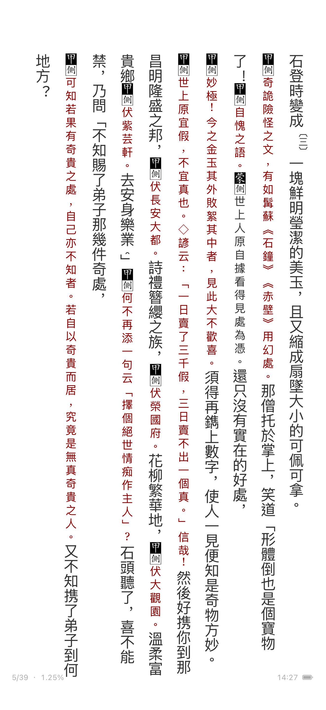
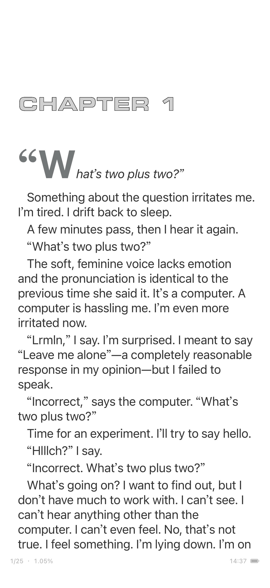
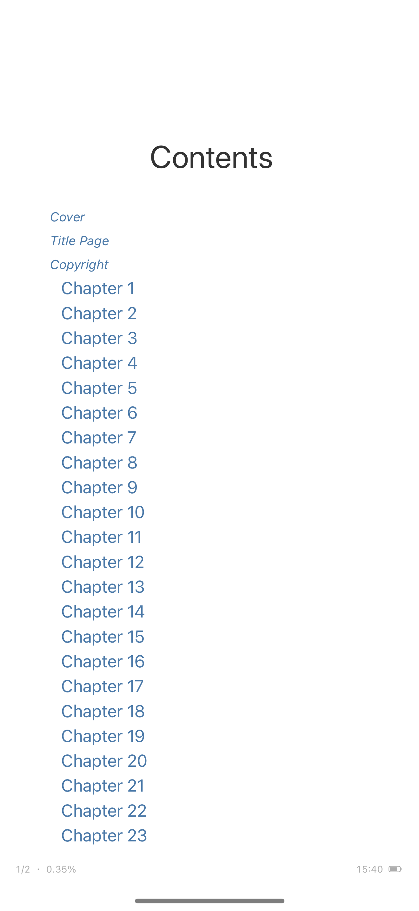
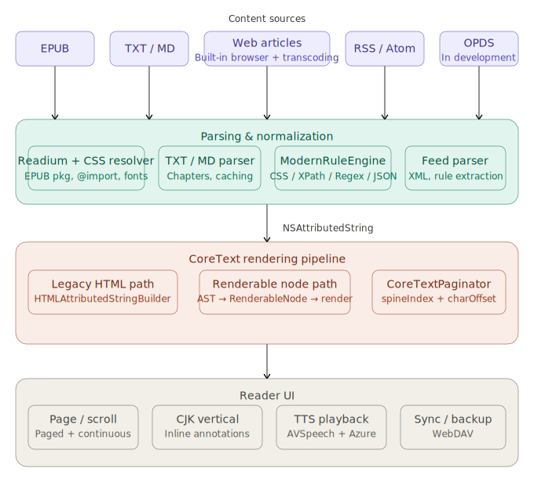

# 閱讀

[English](README.md) | [简体中文](README.zh-Hans.md) | [繁體中文](README.zh-Hant.md)

<p align="center">
  
</p>

<p align="center">
  <strong>一個用 CoreText 打造的 iOS 原生閱讀引擎，不是 WebView。</strong><br>
  開源裡你能找到最好的原生 iOS 閱讀引擎。CoreText 渲染，零 WebView。
</p>

## 展示

<table width="100%">
  <tr style="border: none;">
    <td width="33.3%" align="center" style="border: none; vertical-align: top;">
      <br>
      <svg width="32" height="32" viewBox="0 0 24 24" fill="none" stroke="#6d28d9" stroke-width="2" stroke-linecap="round" stroke-linejoin="round" aria-label="Book icon"><path d="M4 19.5A2.5 2.5 0 0 1 6.5 17H20"></path><path d="M6.5 2H20v20H6.5A2.5 2.5 0 0 1 4 19.5v-15A2.5 2.5 0 0 1 6.5 2z"></path></svg>
      <h3>CJK 豎排閱讀</h3>
      
      <p style="font-size: 0.9em; color: #666; margin-top: 10px;">《紅樓夢》(脂評本): 豎排文本、行間注釋和緊湊標注。</p>
    </td>
    <td width="33.3%" align="center" style="border: none; vertical-align: top;">
      <br>
      <svg width="32" height="32" viewBox="0 0 24 24" fill="none" stroke="#15803d" stroke-width="2" stroke-linecap="round" stroke-linejoin="round" aria-label="Text icon"><path d="M3 5v14c0 1.1.9 2 2 2h14c1.1 0 2-.9 2-2V5c0-1.1-.9-2-2-2H5c-1.1 0-2 .9-2 2z"></path><path d="M7 15l3-6 3 6"></path><path d="M8 13h4"></path></svg>
      <h3>英文 EPUB</h3>
      
      <p style="font-size: 0.9em; color: #666; margin-top: 10px;">出版商 CSS 支持: 首字母下沉、嵌套邊距和字體級聯。</p>
    </td>
    <td width="33.3%" align="center" style="border: none; vertical-align: top;">
      <br>
      <svg width="32" height="32" viewBox="0 0 24 24" fill="none" stroke="#1d4ed8" stroke-width="2" stroke-linecap="round" stroke-linejoin="round" aria-label="List icon"><line x1="8" y1="6" x2="21" y2="6"></line><line x1="8" y1="12" x2="21" y2="12"></line><line x1="8" y1="18" x2="21" y2="18"></line><line x1="3" y1="6" x2="3.01" y2="6"></line><line x1="3" y1="12" x2="3.01" y2="12"></line><line x1="3" y1="18" x2="3.01" y2="18"></line></svg>
      <h3>目錄導航</h3>
      
      <p style="font-size: 0.9em; color: #666; margin-top: 10px;">優先使用 toc.ncx 和 nav.xhtml, 而非基於骨架的章節猜測。</p>
    </td>
  </tr>
</table>

## 為什麼 CoreText 渲染如此不同

<table width="100%">
  <tr style="border: none;">
    <td width="50" style="border: none; vertical-align: top;">
      <svg width="24" height="24" viewBox="0 0 24 24" fill="none" stroke="#7c3aed" stroke-width="2" stroke-linecap="round" stroke-linejoin="round" aria-label="Star icon"><polygon points="12 2 15.09 8.26 22 9.27 17 14.14 18.18 21.02 12 17.77 5.82 21.02 7 14.14 2 9.27 8.91 8.26 12 2"></polygon></svg>
    </td>
    <td style="border: none; vertical-align: top;">
      <strong>規範優先的保真度</strong><br>
      忠實實現 EPUB 和 CSS 規範，確保渲染效果的一致性和可預測性。
      <ul>
        <li><strong>手動解析 CSS</strong>: 出版商樣式表被解析並解析為自定義級聯，將 <code>text-indent</code>、<code>font-size</code> 和 <code>:first-letter</code> 等屬性轉換為 <code>NSAttributedString</code> 屬性。</li>
        <li><strong>精確解析</strong>: 處理簡寫屬性、百分比值和繼承屬性，不依賴系統佈局引擎。</li>
      </ul>
    </td>
  </tr>
  <tr style="border: none;">
    <td width="50" style="border: none; vertical-align: top;">
      <svg width="24" height="24" viewBox="0 0 24 24" fill="none" stroke="#16a34a" stroke-width="2" stroke-linecap="round" stroke-linejoin="round" aria-label="Layout icon"><rect x="2" y="2" width="20" height="8" rx="2" ry="2"></rect><rect x="2" y="14" width="20" height="8" rx="2" ry="2"></rect><line x1="6" y1="6" x2="6.01" y2="6"></line><line x1="6" y1="18" x2="6.01" y2="18"></line></svg>
    </td>
    <td style="border: none; vertical-align: top;">
      <strong>高級佈局</strong><br>
      豎排、紅寶石 (Ruby)、腳注、註釋、首字母放大和嵌套邊距。
      <ul>
        <li><strong>CJK 豎排</strong>: 具備軸向感知能力的渲染，處理從欄頂開始的行間進程和塊方向範圍。拉丁字符被選擇性地解除豎排並重新居中。</li>
        <li><strong>行內注釋</strong>: 通過保留欄寬佔位符並手動繪製注釋，支持密集的豎排注釋（例如脂評本），並將長注釋跨頁拆分。</li>
      </ul>
    </td>
  </tr>
  <tr style="border: none;">
    <td width="50" style="border: none; vertical-align: top;">
      <svg width="24" height="24" viewBox="0 0 24 24" fill="none" stroke="#2563eb" stroke-width="2" stroke-linecap="round" stroke-linejoin="round" aria-label="Navigation icon"><path d="M14 2H6a2 2 0 0 0-2 2v16a2 2 0 0 0 2 2h12a2 2 0 0 0 2-2V8z"></path><polyline points="14 2 14 8 20 8"></polyline><line x1="16" y1="13" x2="8" y2="13"></line><line x1="16" y1="17" x2="8" y2="17"></line><polyline points="10 9 9 9 8 9"></polyline></svg>
    </td>
    <td style="border: none; vertical-align: top;">
      <strong>智能導航</strong><br>
      在可用時使用 <code>toc.ncx</code> 和 <code>nav.xhtml</code> 以獲得精確的目錄和位置。
      <ul>
        <li><strong>持久的閱讀位置</strong>: 進度存儲為 <code>(spineIndex, charOffset)</code>，確保在字體大小更改、設備旋轉或章節加載後位置保持不變。</li>
        <li><strong>目錄優先級</strong>: 優先考慮明確的導航清單，而非基於骨架的猜測，並自動對後備標題進行去重。</li>
      </ul>
    </td>
  </tr>
  <tr style="border: none;">
    <td width="50" style="border: none; vertical-align: top;">
      <svg width="24" height="24" viewBox="0 0 24 24" fill="none" stroke="#ea580c" stroke-width="2" stroke-linecap="round" stroke-linejoin="round" aria-label="Design icon"><circle cx="12" cy="12" r="10"></circle><path d="M12 16a4 4 0 0 0 0-8"></path><line x1="12" y1="2" x2="12" y2="4"></line><line x1="12" y1="20" x2="12" y2="22"></line><line x1="4.93" y1="4.93" x2="6.34" y2="6.34"></line><line x1="17.66" y1="17.66" x2="19.07" y2="19.07"></line><line x1="2" y1="12" x2="4" y2="12"></line><line x1="20" y1="12" x2="22" y2="12"></line><line x1="4.93" y1="19.07" x2="6.34" y2="17.66"></line><line x1="17.66" y1="4.93" x2="19.07" y2="6.34"></line></svg>
    </td>
    <td style="border: none; vertical-align: top;">
      <strong>默認優雅</strong><br>
      精心調整的字體、間距和主題，營造優雅的閱讀體驗。
      <ul>
        <li><strong>原生保真度</strong>: 主閱讀器完全不依賴 WebView，實現對行高、字母間距和段落邊距的絕對控制。</li>
      </ul>
    </td>
  </tr>
</table>

## 技術亮點

- **原生 CoreText 渲染**：左右翻頁與連續滾動，不經 WebView。
- **CJK 直排**：繁簡中文直排、CJK 標點處理、CJK/拉丁混排，已用含行內批註與彩色註解的複雜直排 EPUB 驗證。
- **EPUB CSS 解析**：支援 `:first-letter` 首字放大、巢狀區塊邊距累加、`<hr>` 含 width/margin/alignment、`text-indent`（含負值 hanging indent）、字型層疊、百分比邊距/內距/寬度解析。
- **穩定閱讀位置**：以 `(spineIndex, charOffset)` 儲存進度，而非會隨排版變化漂移的頁碼。
- **大書處理**：數百萬字 TXT 與 EPUB 驗證通過。
- **Legado 相容書源規則**：匯入並執行相容 [Legado](https://github.com/gedoor/legado) 格式的使用者書源。
- **線上閱讀管線**：將網頁與規則型書源正規化為閱讀格式。

## 渲染管線

<p align="center">
  
</p>

兩條平行路徑產出 CoreText 屬性字串：

```
舊路徑：    HTMLAttributedStringBuilder.build() → NSAttributedString
                    ↓                            ↓
RenderableNode：HTMLStyledASTRenderableNodeConverter → RenderableNode IR → NodeAttributedStringRenderer
                    ↓                            ↓
              共享層：CSSParser → ResolvedStyle → CoreTextPageView.drawLines()
```

任何 CSS 屬性變更必須同時更新兩條路徑。共享層負責 CSS 解析、ResolvedStyle，以及 `CoreTextPageView` 的畫面繪製。

**翻頁 vs 滾動**：`EPUBPageRenderer` 將內容路由至 `CoreTextPageEngine`（翻頁）或 `CoreTextScrollEngine`（滾動）。`CoreTextPageView` 及區塊 Cell 繪製最終 CoreText 畫面。

**EPUB 目錄**：優先使用 `toc.ncx` / `nav.xhtml` 條目，優於 spine 章節清單。spine 非目錄項目（續頁、分割後記）會被排除。spine fallback 包含相同標題去重。

## 功能概覽

- CoreText 翻頁與滾動閱讀器
- EPUB CSS 渲染（出版者樣式表、字型層疊、首字放大、邊距）
- CJK 排版：直排、標點、段落縮排
- 本機書庫：EPUB、TXT、Markdown 匯入，含快取、封面、書籤、註解
- 線上閱讀：網頁正規化、規則型書源擷取
- RSS 閱讀器：RSS/Atom 訂閱、規則型提取、OPML 匯入
- TTS：AVSpeechSynthesizer 及 HTTP 自訂 TTS
- WebDAV 同步：備份、還原、書庫與進度同步
- 閱讀器自訂：字體、字級、行距、間距、邊距、主題、翻頁/滾動模式、直排

## 系統需求

- iOS 18.0+、Xcode 16+、Swift 5

## 快速開始

```bash
git clone https://github.com/CHANG-JUI-LIN/Yuedu-reader.git
cd Yuedu-reader
open Yuedu-Reader.xcodeproj
```

選擇 `Yuedu-Reader` scheme，建置至模擬器或實機。或直接執行：

```bash
./scripts/build.sh
```

## 目錄結構

```text
iOS/
├── Models/
│   ├── App/              # 全域設定、DesignTokens、AppDependencies
│   ├── Book/             # ReadingBook、Bookmark、BookStore
│   ├── BookSource/       # 書源定義與擷取管線
│   ├── LocalBook/        # EPUB/TXT/Markdown 解析器
│   ├── Online/           # 線上閱讀與網頁正規化
│   ├── RSS/              # RSS 模型、訂閱解析
│   ├── Reader/CoreText/  # CoreText 翻頁引擎、滾動引擎、CSS 解析、渲染
│   ├── RuleEngine/       # CSS/XPath/Regex/JSON 規則提取
│   ├── Sync/             # WebDAV 同步管理
│   └── TTS/              # 語音播放協調
├── Views/                # SwiftUI 畫面
├── ViewModels/           # ObservableObject ViewModel
├── Assets/               # 資產目錄與規則引擎資源
└── *.lproj/              # 本地化：zh-Hant、zh-Hans、en
```

## 開發規則

- 使用者字串使用 `localized()`，更新三個 `.lproj` 檔案。
- 閱讀位置以內容座標為準，不用頁碼。
- UI 樣式使用設計 Token API：`DSColor`、`DSFont`、`DSSpacing`。
- 新增或修改 View 時，加入 `#Preview`。
- 新增 CSS 屬性至 `ResolvedStyle` 時，同步 `RenderStyle` 欄位、更新 `RenderStyle.from`，並處理兩條渲染路徑。
- 巢狀區塊 CSS 邊距透過 `inheritedBlockMarginLeft` 累加。

請見 [CONTRIBUTING.md](CONTRIBUTING.md)。架構筆記：[Technotes/Architecture.md](Technotes/Architecture.md)。

## 授權

MIT。詳見 [LICENSE](LICENSE)。連結 [Readium](https://github.com/readium) 元件（BSD 授權）。
