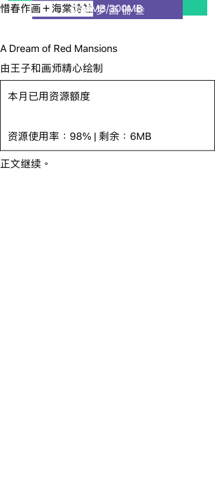
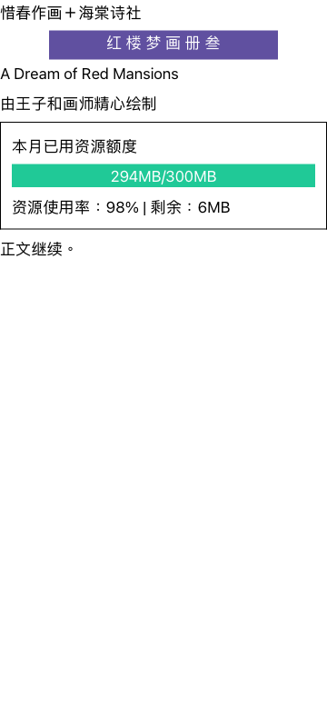
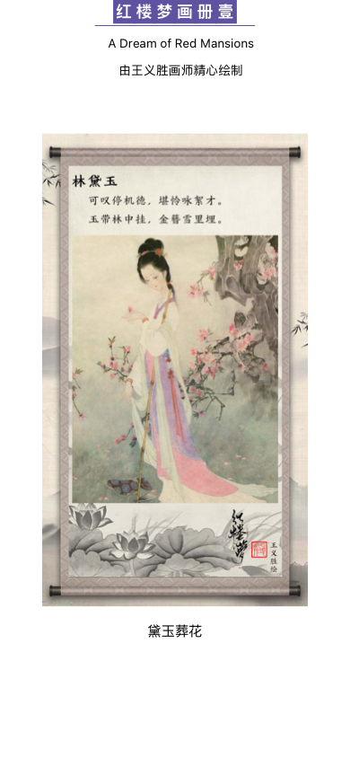
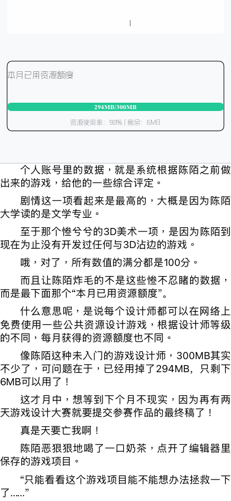

# 翻頁／捲動渲染分歧

後續更新：依使用者要求，正常 EPUB 翻頁已啟用 BrowserAuto，並補齊 Browser
頁眉頁腳接線；[目前狀態與原書驗證](2026-09-09-title-page-routing.md)。
下文保留啟用前 Legacy 繪製收斂工作的驗證範圍。

## 收斂狀態

尚未全面收斂。EPUB、TXT、Markdown、網路章節共用章節建構／快取，
翻頁仍由 CoreTextPaginator 產生頁面，捲動由 CoreTextChunkSlicer 產生區塊；
本輪已共用橫排背景／邊框／裝飾圖片的抽取；其他附件抽取與呈現仍有分別實作。
PDF、漫畫與固定版面 EPUB 另走固定頁面閱讀器。
不能把共用 ChapterDocumentStore 當作完整渲染一致的證明。

使用者指定以捲動的正確呈現為基準。本輪未啟用只供翻頁使用的 BrowserAuto，
也沒有切換 Lexbor 或改動歷史 golden。

## 已確認的視覺根因

翻頁把帶有指定高度／置中寬度的背景填色等裝飾，重新定位到頁面頂部，
並另行繪製其內容。CSS 尺寸本來只決定外觀大小，這條額外路徑卻丟失了
排版完成的位置。因此紫色標題底、綠色資源進度條及其內容一起移到頁頂，
互相覆蓋；原本應有裝飾的位置變空白。

修正橫排路徑，讓這些裝飾與內容依原 CTFrame 位置繪製。原書驗證另發現
捲動漏抽最外層背景，已將兩側背景／邊框／裝飾圖片的抽取收為同一方法，
保留捲動的內容排列並補回原書背景。直排既有幾何處理保留。

同一份來源、同一個 CTFrame 的實際繪製結果：

| 修正前翻頁 | 捲動基準 | 修正後翻頁 |
|---|---|---|
|  |  |  |

這是從回報的 CSS 結構縮小出的重現，不是原書整章驗收。
修正後翻頁／捲動的 RGBA 像素完全一致；捲動修正前後的 PNG 也完全一致。

## 頁眉頁腳根因

ReaderView 原本只向當時已存在的 engine 綁定 pageBarsProvider。
EPUB 會先非同步開啟 PublicationSession，綁定執行時 engine 尚未建立，
因此直接返回；之後的設定刷新也不會補綁。翻頁又已停用畫面上的固定覆蓋列，
於是兩邊都沒有繪出頁眉頁腳。另發現純圖片 EPUB 頁面提早返回，跳過了
頁眉頁腳繪製；這條出口也納入同一個繪製完成流程。

改由 EPUBPageRenderer 持有 provider，在每次引擎建立／替換，以及 provider
更新時統一接上，並使頁面快照失效。捲動保留既有的固定頁眉頁腳。

## 主工作目錄已完成的 focused 回歸

- CoreTextPagedScrollAppearanceTests：1 個方法／2 個參數案例通過；比較完整畫面，
  包含最外層背景。
- EPUBPageBarsLifecycleTests：3 通過；非同步 EPUB 開啟前綁定、引擎替換、
  自訂頁眉／頁腳樣式更新與清除、純圖片頁的兩個欄帶均有實際繪製。
- CoreTextWritingModeTests：25 通過。
- ChapterTitleRenderableLayoutTests：3 通過。
- CoreTextScrollTests：3 個相關方法通過，涵蓋裝飾、浮動圖片與章節背景。
- ReaderBarRendererTests：6 通過。
- EPUBRenderingTests：5 個相關方法通過，涵蓋背景圖定位、巢狀裝飾、避免分頁與圖片頁。

最新主工作目錄共 46 個測試方法通過，0 失敗、0 跳過。
[機器可讀結果與來源 SHA-256](paged-scroll-verification.json)。

## 原書指定頁對照

以 PublicationSession 開啟原書，使用與主目錄逐位元相同的 Paginator／Slicer
原碼，在隔離工作樹執行 CoreTextReportedAppearanceTests。紅樓夢畫冊 spine 4
與全能遊戲設計師 spine 10 的資源面板指定頁，兩組實際繪製像素均完全一致。
測試條件為 390 × 844、字級 17、零外框留白，兩種繪製方式使用同一 CTFrame，
以隔離繪製差異與合理的分頁／捲動切分差異。

| 原書指定頁 | 翻頁 | 捲動 |
|---|---|---|
| 畫冊 |  |  |
| 資源面板 |  |  |

此處的通過範圍不代表所有書籍、樣式與固定頁面格式已完成渲染收斂。
