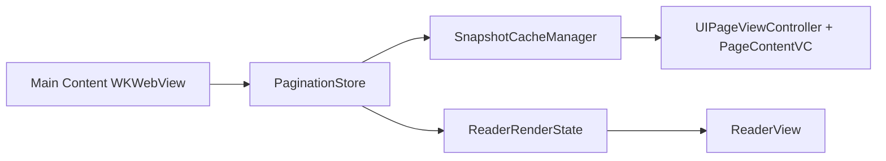

# EPUB 單一排版真相 + 離屏快照緩衝層設計文檔

**日期**：2026-03-28
**狀態**：已批准，待實施
**背景**：修復 EPUB 閱讀器的無限 loading、重複頁、白底與快照不同步問題，同時保留 Readium CSS、多欄分頁與跟手翻頁動畫。

---

## 1. 問題定義

當前 EPUB 閱讀器的核心問題不是單一 bug，而是架構中存在多個互相競爭的「排版真相來源」：

- 主內容 `WKWebView` 在產生真實頁面
- snapshot / 預載路徑又在用另一套 WebView 或另一套時序參與排版
- UI gate 又把「可閱讀」綁定到全書掃描或 snapshot 進度

這會直接導致：

- `paginationReady` 與快照完成時機互相纏繞，造成無限 loading
- 同一頁號對應到不同 layout generation，造成重複頁
- 翻頁時臨時截圖，導致白底與空頁
- `ReaderView`、`LiveWebReader`、snapshot provider 彼此共享過多責任，難以穩定修復

本次設計的目標，是在保留現有產品方向的前提下，重建責任邊界。

---

## 2. 核心原則

### 2.1 單一排版真相

真實的 `pageOffsets`、`currentPage`、`totalPages`、章節內頁位與全局頁映射，只能來自主內容 `WKWebView`。其他元件不得自行計算、修正或回寫頁模型。

### 2.2 動畫不生成排版

翻頁動畫層只能消費已經確認過的靜態頁面圖像。它可以做位移、疊層、過渡，但不能自行決定頁數、頁位、章節映射或 readiness。

### 2.3 離屏渲染只做快照

允許保留一個隱藏的 render worker，用來根據主內容層已確認的 offset 執行 `scrollTo + takeSnapshot`。但這個 worker 只是渲染工人，不是 authority：

- 不能參與 `paginationReady`
- 不能回寫 `totalPages` / `globalPageMap`
- 不能成為 UI 是否解鎖的依據

### 2.4 閱讀 gate 只綁當前章節

只要當前章節已有有效 `pageOffsets`，UI 就必須可閱讀。全書掃描、背景快照、總頁數補完都不能再作為主 loading gate。

---

## 3. 架構概覽

新的結構分為四層：

1. **Interaction Layer**  
   真實內容層，唯一可互動的主內容 `WKWebView`。

2. **State Layer**  
   保存 canonical offsets、頁數、章節映射與 `layoutGeneration` 的純資料層。

3. **Render Buffer Layer**  
   離屏快照緩衝層，負責 snapshot 任務排隊、渲染、快取，但不掌管排版真相。

4. **Animation Layer**  
   `UIPageViewController` 與靜態 `UIImage` 頁面容器，專注於跟手翻頁效果。

這四層的單向資料流如下：



---

## 4. 類別責任表

### 4.1 `EPUBReaderEngine`

對外唯一入口。職責：

- 開書、跳章、翻頁、設定更新
- 管理章節切換與目前頁位置
- 組合 `ReaderRenderState` 供 UI 讀取

不直接處理 snapshot queue，不直接掌管 WebView 截圖細節。

### 4.2 `EPUBContentWebViewController`

唯一真實內容來源。職責：

- 注入 Readium CSS
- 載入章節 HTML
- 接收 `paginationReady`
- 產生 canonical offsets
- 執行真實 `goToPage` / `scrollTo(offset)`

所有頁模型資料只能由它寫入 `PaginationStore`。

### 4.3 `PaginationStore`

純資料層。職責：

- 保存 `chapterID -> pageOffsets / pageCount`
- 保存 `globalPageMap`
- 保存 `currentGlobalPage`
- 保存 `layoutGeneration`

只有內容 WebView 可寫，其他模組只能讀。

### 4.4 `SnapshotCacheManager`

快照任務中心。職責：

- 接受 `(chapterID, pageIndex, layoutGeneration)` 任務
- 排隊調度 hidden renderer
- 管理 snapshot 快取與失效
- 對 `UIPageViewController` 提供同步可讀的 cached image

### 4.5 `HiddenSnapshotRenderer`

離屏渲染工人。職責：

- 根據已確認 offset 執行 `scrollTo`
- 等待版面穩定
- 執行 `takeSnapshot`

不計算頁數，不回寫頁模型，不參與 gate。

### 4.6 `PageContentViewController`

`UIPageViewController` 的單頁容器。職責：

- 只持有 `UIImageView`
- 綁定單一 page identity
- 不觸碰 WebView，不觸發截圖

### 4.7 `ReaderView`

只負責 UI 組裝與互動切換。職責：

- 根據 `ReaderRenderState` 決定 loading / interactive / recovering
- 管理真實 WebView 與 `UIPageViewController` 的顯示切換

不得再從多個底層旗標自行推導 readiness。

---

## 5. 狀態模型

狀態流縮成五個狀態：

```swift
enum ReaderRenderPhase {
    case bootstrapping
    case chapterReady
    case snapshotWarming
    case interactive
    case recovering
}
```

### 狀態定義

- `bootstrapping`  
  書剛開啟，主 WebView 尚未完成當前章節載入。

- `chapterReady`  
  當前章節已收到有效 `pageOffsets`，此時必須解鎖閱讀。

- `snapshotWarming`  
  閱讀已可互動，但前後頁快照仍在補齊。這個狀態只影響動畫品質，不得重新鎖住閱讀。

- `interactive`  
  當前頁與前後頁快照可用，處於穩態。

- `recovering`  
  章節切換、viewport 改變、字級改變後，主內容層重新分頁。可短暫停動畫，但不得回到全屏無限 loading。

### Loading 規則

唯一主 loading 規則：

- 當前章節沒有有效 `pageOffsets`：loading
- 當前章節已有有效 `pageOffsets`：不可 loading

以下訊號不得再觸發主 loading：

- `snapshotProgress`
- 全書掃描完成度
- `totalPages` 是否補齊

---

## 6. Snapshot Job Queue 設計

`SnapshotCacheManager` 需維持一條串行任務隊列。

### 6.1 Job key

每張快照的身份必須是：

```swift
(chapterID, pageIndex, layoutGeneration)
```

這是避免重複頁的核心。任何 layout generation 改變，都不能沿用舊圖。

### 6.2 Job 狀態

```swift
enum SnapshotJobState {
    case scheduled
    case rendering
    case stabilizing
    case capturing
    case cached
    case invalidated
}
```

### 6.3 流程

1. 使用者停在第 `N` 頁時，預設排入 `N-1 / N / N+1`，可選擇補 `N+2`
2. renderer 根據主內容層已確認的 offset 執行 `scrollTo`
3. 等待 scroll 與版面穩定
4. 執行 `takeSnapshot`
5. 存入快取
6. 若發現 `layoutGeneration` 已變，該任務直接失效

### 6.4 硬限制

- `viewControllerBefore/After` 不得現場觸發截圖
- 同一時間只允許單一 snapshot renderer 任務執行
- queue 只接受來自主內容層已確認頁位的工作

---

## 7. UIPageViewController 切換時序

### 7.1 平時閱讀

- 真實 `WKWebView` 顯示
- `UIPageViewController` 隱藏
- snapshot cache 在背景預抓前後頁

### 7.2 手勢開始

- 顯示 `UIPageViewController`
- 隱藏真實 `WKWebView`，但不卸載
- `PageContentViewController` 從 cache 讀取 `prev/current/next`

### 7.3 手勢進行中

- 只移動靜態圖
- 不命令真實 WebView

### 7.4 手勢結束並 commit

- 真實 WebView 一次性跳到目標 offset
- `PaginationStore` 更新 `currentPage`
- 重新排入新中心頁的快照任務

### 7.5 對齊完成

- 真實 `WKWebView` 重新顯示
- `UIPageViewController` 收起
- 恢復選詞、點擊、連結等真互動能力

---

## 8. 失敗處理與降級

### 8.1 快照缺圖

若前後頁其中一張圖尚未完成：

- 動畫層可降級為只使用現有頁與簡單背板
- 不阻塞閱讀
- 不回退到主 loading

### 8.2 Layout 變更

字級、viewport、主題、章節改變時：

- `layoutGeneration` 增量
- 舊 snapshot key 全部失效
- queue 取消未完成任務並重建

### 8.3 章節跨越

跨章時必須先讓主內容 WebView 完成新章節 `paginationReady`，再建立新章快照任務。不得沿用舊章圖。

---

## 9. 現有檔案的調整方向

| 文件 | 調整方向 |
|------|----------|
| `yuedu app/Models/LiveWebReader.swift` | 逐步降格成 facade，拆出內容 WebView 控制、頁模型、snapshot queue |
| `yuedu app/Models/EPUBSnapshotWebView.swift` | 退出主排版路徑；若保留，只作 hidden renderer 或 helper |
| `yuedu app/Models/PageSnapshotProvider.swift` | 改造成同源 snapshot cache/provider，不再依賴第二排版來源 |
| `yuedu app/Models/EPUBPageRenderer.swift` | 保留可重用的純資料/頁模型能力，移除第二排版責任 |
| `yuedu app/Views/ReaderView.swift` | 改為只讀 `ReaderRenderState`，不自行推導 loading gate |
| `yuedu app/Views/ReaderPageViewController.swift` | 改成純動畫容器，僅消費已快取的 `UIImage` |
| `yuedu app/Views/SnapshotReaderView.swift` | 重新定位成 animation layer 組件；若責任重疊，應併回單一路徑 |

---

## 10. 實施順序

### Phase 1: 收斂排版真相

- 把 `pageOffsets`、`currentPage`、`totalPages`、章節映射的唯一寫入點收回主內容 WebView
- 清掉第二排版來源對頁模型的回寫

### Phase 2: 收斂閱讀 gate

- `ReaderView` 只依賴當前章節是否已有有效 offsets
- 移除 `snapshotProgress` / 全書掃描對主 loading 的影響

### Phase 3: 建立離屏快照緩衝層

- 建立 `SnapshotCacheManager`
- 建立 hidden renderer
- 實作 `(chapterID, pageIndex, layoutGeneration)` 快取鍵

### Phase 4: 重接動畫層

- `UIPageViewController` 改成只消費靜態圖
- 手勢開始/結束時切換真 WebView 與 animation layer

### Phase 5: 補測試與保護

- 驗證重複頁保護
- 驗證字級與旋轉下的 generation invalidation
- 驗證跨章恢復與降級路徑

---

## 11. 驗收標準

完成後應滿足：

- 開書只要當前章節完成 `paginationReady` 即可閱讀
- 不再因全書掃描或 snapshot 補齊而卡在無限 loading
- `UIPageViewController` 不再出現明顯重複頁
- 翻頁動畫不再依賴臨時截圖
- layout 變更後不再錯用舊 generation 的快照

這份設計刻意保留 Readium CSS、多欄分頁與跟手動畫，但把它們的資料依賴改成單向，避免再次落入雙 WebView 同步地獄。
